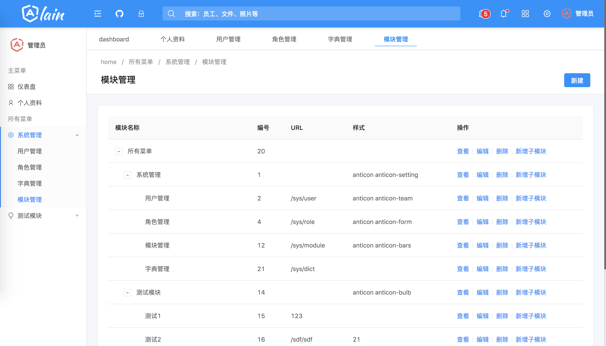

# spring-boot-angular

基于 Spring Boot + Angular 的前后端分离框架。

## 项目简介

* 这是一套基于 Spring Boot + MyBatis-Plus + Angular 的前后端分离框架。
* 后端使用 Maven 对项目进行管理，提高项目的易开发性、扩展性。
* 前端使用 Angular 构建单页面应用，UI 采用 [NG-ZORRO](https://ng.ant.design/)。

## 主要功能（开发中...）

### 电脑端

- [x] 登录、退出登录
- [ ] 部门管理
- [x] 用户管理
- [x] 菜单管理
- [x] 角色管理
- [x] 权限管理
- [x] 日志管理
- [ ] 系统配置管理
- [ ] 个人信息、修改密码

## 依赖

### java后端依赖环境

* Maven 3
* Java 8
* Spring Boot 2.7.18
* PostgreSQL

### 前端依赖环境

* Node.js
* npm & yarn
* Angular 16
* ng-zorro-antd 16
* ng-alain 16

## 工程说明

完善中...

## 本地运行

1. 启动后台项目: 使用idea启动，或打包后 `java -jar xxx.jar`
2. 启动前台项目: `npm start`
3. 电脑打开页面：`http://localhost:4200`

## 效果图

## 相关链接

* [Spring Boot](https://spring.io/projects/spring-boot):   spring的全新框架，简化新Spring应用的初始搭建以及开发过程。
* [Angular](https://angular.cn/):           一套前端单页面应用开发框架。
* [Ant design](https://ant.design/):      一个服务于企业级产品的设计体系。
* [ng-zorro](https://ng.ant.design/):      Ant Design 的 Angular 实现
* [ng-alain](https://ng-alain.com/):     一个基于 Antd 中后台前端解决方案

## TODO

- [ ] 前端遇到接口异常时，按钮的 loading 状态要取消

## License

[MIT License](./LICENSE)

